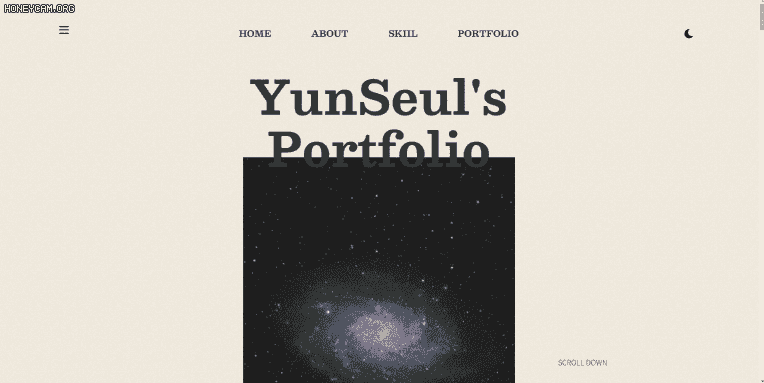
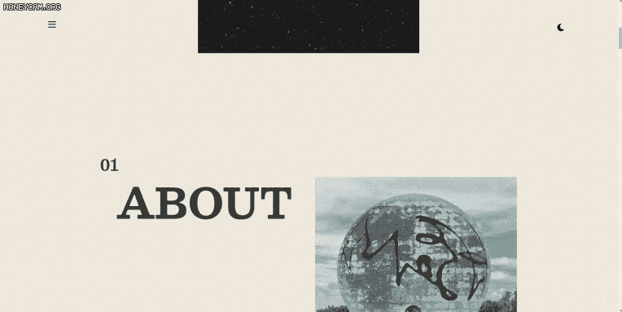
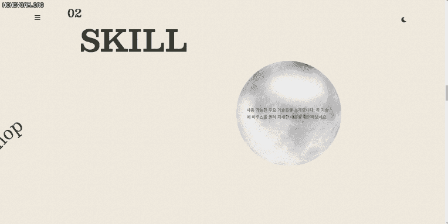
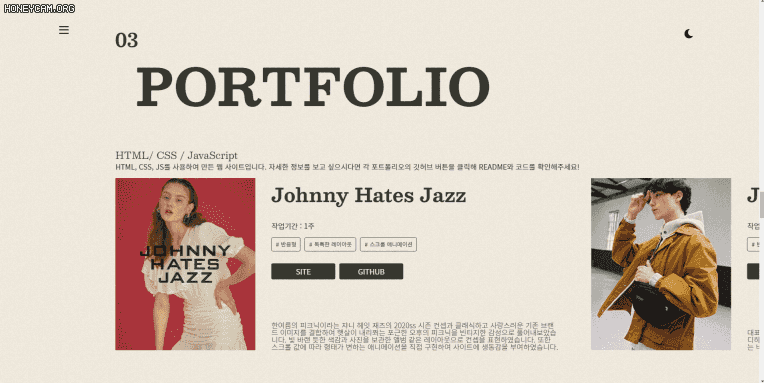
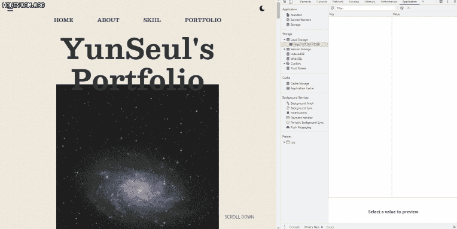
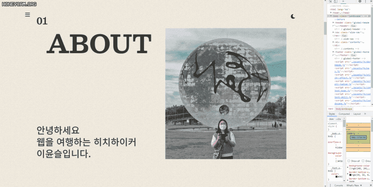

# 이윤슬 포트폴리오 사이트

## 디자인 컨셉

`웹을 여행하는 히치하이커` 라는 슬로건에 맞추어 서정적인 우주를 표현해보았습니다. 우주와 관련된 이미지 요소의 활용하여 우주 컨셉을 각인시키고 베이지색과 짙은 회색 두 톤을 사용하여 서정적이면서도 차분한 분위기를 연출하였습니다. 웹사이트 화면 전체에 노이즈 필터 효과를 주어 고전적인 감성을 추가하였습니다.

## Sections

- Header

  

  본 사이트의 헤더는 사이드 메뉴 버튼, 네비게이션, 다크모드 전환 버튼으로 구성되었습니다. 네비게이션 아이템에 마우스를 올리게 되면 토성 아이콘이 포인터로 따라오도록 연출하였습니다.

- Home

  

  포트폴리오의 홈 섹션입니다. 커다란 우주 이미지를 배치하여 컨셉을 표현하였습니다. 처음 사용자에게 보여지는 화면이므로 텍스트 애니메이션과 블라인드가 올라가면서 이미지가 보이는 효과를 주어 사용자의 흥미를 이끌어내고자 하였습니다.

- About

  

  저를 소개하는 섹션입니다. 새롭게 변화하는 웹에 맞추어 발전하고자 하는 포부를 담았습니다. 스크롤 위치에 따라 텍스트와 이미지를 보여주는 효과를 넣어 생동감을 주었습니다.

- Skill

  

  사용할 수 있는 스킬을 소개하는 섹션입니다. 달 이미지를 배치하여 본 사이트의 컨셉을 다시 한번 강조하였습니다. `SVG`를 활용하여 텍스트가 곡선 형태로 달을 지나가도록 연출하였습니다. `Fetch API`를 사용하여 스킬 아이템에 마우스를 올리면 각 스킬 아이템에 해당하는 설명이 나오도록 하였습니다.

- Portfolio

  

  그 동안 작업해온 결과물을 소개하는 섹션입니다. 스크롤을 하면 화면이 가로로 움직이도록 연출하였습니다. 각 포트폴리오에 대한 정보와 소개글이 있으며 `SITE 버튼`을 통해 해당 사이트로 이동할 수 있으며 `GITHUB 버튼`을 통해 더욱 자세한 소개와 코드를 확인할 수 있습니다.

## 구현 기능

- 다크모드

  

  다양한 환경에서 웹을 이용하는 사용자를 고려하여 다크모드를 구현해보았습니다. 사이트 오른쪽 상단에 있는 버튼을 클릭할 때 BODY에 클래스를 주어 모드 전환이 가능하도록 하였습니다. 특히 모드 전환 시 `Local Storage`에 정보를 저장하여 새로고침을 하거나 잠시 사이트를 나가도 사용자가 정한 모드가 유지될 수 있게 하였습니다.

## 반응형

데스크탑을 기준으로 디자인되었으며 `1320px` 이상, `1320px` 미만 , `1024px` 미만, `768px` 미만을 분기로 반응형을 구현하였습니다.
